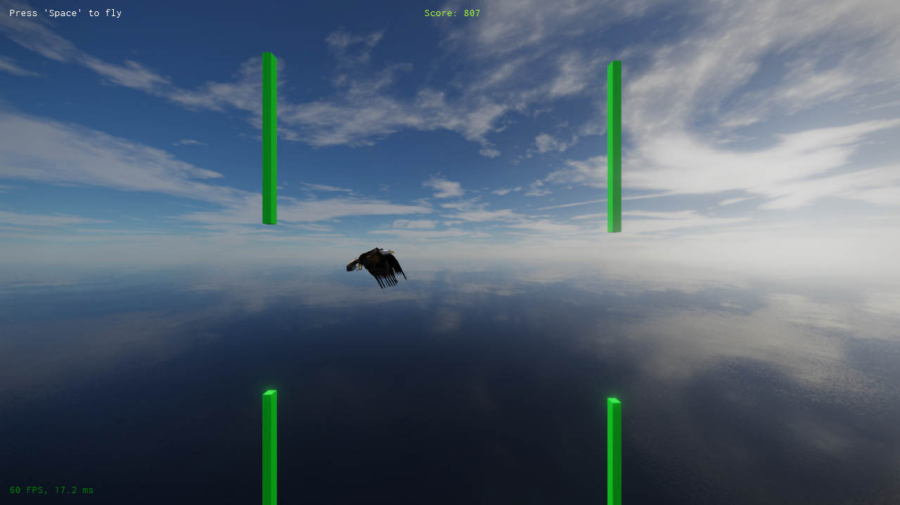

# XII Fly Bird


## Description

#### Video Demo: https://youtu.be/3dwLyYumrUw


Flybird is an easy to play game that has one objective, which is to accumulate as many points as possible by soaring through gateways.

Some of the core ideas that were put into the project are listed as follows;

* Procedural Generation.
* Optimizing standard effects through simple means.
* Console Vars (CVar) for in-game editing.
* Low level and High level scripting with C++ and Typescript.
* State-based animation through a finite state machine.

## Design Choices

When designing a project at a small scale, it is easy to ignore optimizations for the sake of getting the job done. Initially, I wanted the player to actually "fly" through the world and then adjust obstacles appriopriately. This means that the player would always translate in the forwards (+X) direction and just generate obstacles in front of the player at a random distance within a range, outside of the view distance.

That seems like a seemingly good plan but these objects are not being cleaned up from the world as they are useless once the player has crossed them. I thought instead of just spawning obstacles as the user moves forwards, I could have a pre-created pool of objects that would *shift* along with the player as they translate forwards. This means that as the player moves forwards all if the player has moved passed an object and that object exceeds a destroy distance, that objec would be moved in front of the player and will become the farthest obstacle.

**Pseudocode**

```cpp
// Retrieve player object and other related components.

// Apply impulse to the player to move forwards in the +X direction, scaled to the player's frame time.
pDynamicActor->AddLinearImpulse(xiiVec3(0, 0, m_fSpeed * pWorld->GetClock().GetTimeDiff().AsFloatInSeconds()));

// If the input event "Fly" is active, apply flight impulse to the player in the +Z or upward direction, scaled to the player's frame time.
pDynamicActor->AddLinearImpulse(xiiVec3(0, 0, cvar_PlayerJumpImpulse * pWorld->GetClock().GetTimeDiff().AsFloatInSeconds()));

// Move check for the object that can be "destroyed" to move in front of the player.
for (xiiInt32 i = 0; i < scorePoints.length; ++i)
{
    xiiVec3 obstaclePosition = scorePoints[i].GetGlobalPosition();
    xiiVec3 playerPosition = owner.GetGlobalPosition();

    if (obstaclePosition.x < playerPosition.x - m_fDestroyDistance)
    {
        // Offset obstacle to recycle the obstacle object
        obstaclePosition.x = scorePoints[scorePoints.length - 1].GetGlobalPosition().x + 75 * (i + 1);

        // Offset the z position for randomness
        obstaclePosition.z = xiiMath::RandomRange(-60, 60);

        scorePoints[i].SetGlobalPosition(obstaclePosition);
    }
}

```

This method worked but fact remains that the user could not play forever, and the calculations would lose precision as the player progresses. I settled on a final implemetation that would essentially was a smarter way to manage the player and surrounding obstacles, utilizing some of the benefits of a game like this.

The idea stems from two principles, *A sense of motion is relative* and *What is the frame of reference*. I thought to utilize the prefab system (A blueprint for what a game object might contain) and have a spawner which essentially spawns an obstacle object based on the prefab blueprint and attach a simple behavior of moving the object infinitely towards the player (-X direction) and destroy that object once its destruction parameters. This logic is embedded in the obstacle object itself, so it sets its random height and moves towards the player till destruction.

This solution was indeed better than the former as now the player can be stationary and just be able to apply an upwards impulse to themselves, allowing them to play *infinitely* without precision issues.

**Pseudocode**

In the player update script, do the following;

```cpp
////////// Begin Player Update //////////

// Retrieve player object

// If the input event "Fly" is active, apply flight impulse to the player in the +Z or upward direction, scaled to the player's frame time.
pDynamicActor->AddLinearImpulse(xiiVec3(0, 0, flyImpulse * deltaTime));

////////// End Player Update //////////

```

And in the obstacle object, do the following;

```cpp
////////// Begin Initialization //////////

// Compute random height for the obstacle to enforce height variation.
xiiVec3 currentPosition = GetOwner()->GetGlobalPosition();

float randomHeight = xiiMath::RandomRange(heightRange.x, heightRange.y);

currentPosition.z += randomHeight;

GetOwner()->SetGlobalPosition(currentPosition);

////////// End Initialization //////////


////////// Begin Obstacle Update //////////

// Update position
xiiVec3 objectPosition = GetOwner()->GetGlobalPosition();

// Enforce Y position at zero.
objectPosition.y = 0.0f;

// Move object scaled by the player's frame time.
objectPosition.x -= (m_fSpeed * deltaTime);

GetOwner()->SetGlobalPosition(objectPosition);

// Destroy object if close to the world origin.
if (GetOwner()->GetGlobalPosition().DistanceSquared(xiiVec3(0)) < 20)
{
    GetWorld()->DeleteObjectDelayed(GetOwner()->GetHandle());
}

////////// End Obstacle Update //////////
```

With this method, the player is placed conveniently in the coordinate (`100.0, 0, 0`). This makes an convenient method of spawning objects at (`200.0, 0, 0`) and destroying them at (`0.0, 0, 0`).

Most of the logic demo is implemented in C++ and only a small subset, which has to with triggers is implemented in Typescript.

# Screenshots





